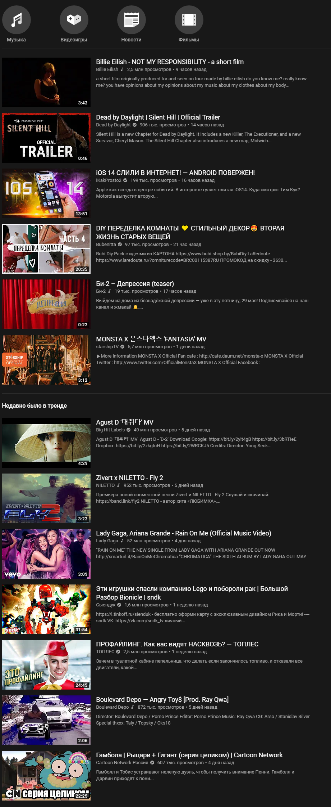

# BlockTube-list
My [BlockTube](https://github.com/amitbl/blocktube) export config.

## About

Now, most of list fields (channels, videos, etc.) is Russian "trash" content.

Currently, I have no mention of why this or that content is blocked.
But if you create an issue or send a pull request, the reason will be added to the `reasons.txt`.

## Install

0. Install BlockTube for your browser.
1. Download `1nfdev_blocktube_backup.json`.
2. Open BlockTube settings.
3. Click on `Import` and choice `1nfdev_blocktube_backup.json`.
4. Done!

## Example (ru-tube)

  
<b>On the screenshot show full list of videos from `Trending`. (‏‎14:19 27.05.2020 - Moscow time)</b>

